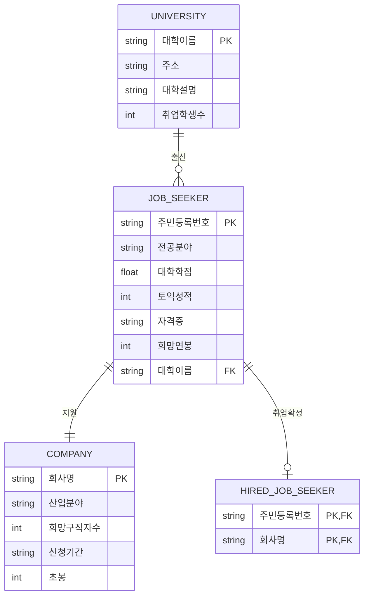
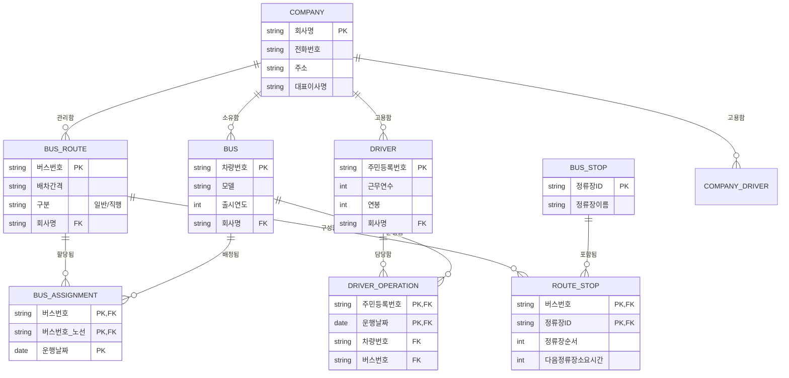

##문제 1의 DB

가정한 내용: 취업이 확정된 구직자들은 별도로 유지해야 하는데 합격 정보를 별도의 테이블에 저장한다고 가정

```mermaid
erDiagram

    COMPANY {
        string 회사명 PK
        string 산업분야
        int 희망구직자수
        string 신청기간
        int 초봉
    }
    
    JOB_SEEKER {
        string 주민등록번호 PK
        string 전공분야
        float 대학학점
        int 토익성적
        string 자격증
        int 희망연봉
        string 대학이름 FK
    }
    
    UNIVERSITY {
        string 대학이름 PK
        string 주소
        string 대학설명
        int 취업학생수
    }

    HIRED_JOB_SEEKER {
        string 주민등록번호 PK, FK
        string 회사명 PK, FK
    }

    UNIVERSITY ||--o{ JOB_SEEKER : "출신"
    JOB_SEEKER ||--|| COMPANY : "지원"
    JOB_SEEKER ||--o| HIRED_JOB_SEEKER : "취업확정"
```

##문제 2의 DB

```mermaid
erDiagram

    COMPANY {
        string 회사명 PK
        string 전화번호
        string 주소
        string 대표이사명
    }

    BUS_ROUTE {
        string 버스번호 PK
        string 배차간격
        string 구분 "일반/직행"
        string 회사명 FK
    }

    BUS_STOP {
        string 정류장ID PK
        string 정류장이름
    }

    ROUTE_STOP {
        string 버스번호 PK, FK
        string 정류장ID PK, FK
        int 정류장순서
        int 다음정류장소요시간
    }

    BUS {
        string 차량번호 PK
        string 모델
        int 출시연도
        string 회사명 FK
    }

    DRIVER {
        string 주민등록번호 PK
        int 근무연수
        int 연봉
        string 회사명 FK
    }

    BUS_ASSIGNMENT {
        string 버스번호 PK, FK
        string 버스번호_노선 PK, FK
        date 운행날짜 PK
    }

    DRIVER_OPERATION {
        string 주민등록번호 PK, FK
        date 운행날짜 PK, FK
        string 차량번호 FK
        string 버스번호 FK
    }

    COMPANY ||--o{ BUS : 소유함
    COMPANY ||--o{ BUS_ROUTE : 관리함
    COMPANY ||--o{ COMPANY_DRIVER : 고용함
    COMPANY ||--o{ DRIVER : 고용함
    
    BUS_ROUTE ||--o{ ROUTE_STOP : 구성함
    BUS_STOP ||--o{ ROUTE_STOP : 포함됨
    
    BUS_ROUTE ||--o{ BUS_ASSIGNMENT : 할당됨
    BUS ||--o{ BUS_ASSIGNMENT : 배정됨
    
    DRIVER ||--o{ DRIVER_OPERATION : 담당함
    BUS ||--o{ DRIVER_OPERATION : 운행됨
```
